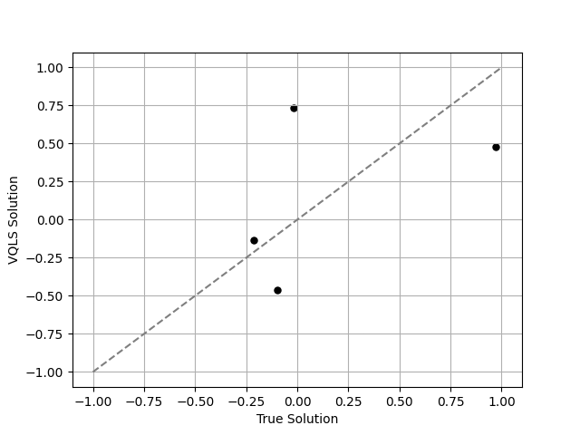

# Variational Quantum Linear Solver Prototype

This repository contains a prototype implementation of the variational quantum linear solver [1,2] that allows to solve linear systems, $A\times x = b$, using variational circuits. 

### Table of Contents

##### For Users

1.  [About the Project](docs/project_overview.md)
2.  [Beginner's Guide](docs/beginners_guide.md)
3.  [Installation](INSTALL.md)
4.  [Quickstart Guide](docs/quickstart_guide.md)
5.  [Tutorials](docs/tutorials/README.md)
6.  [How-Tos](docs/how_tos/README.md)
7.  [Prototype Template File Glossary](docs/file-map-and-description.md)
8.  [References and Acknowledgements](#references-and-acknowledgements)
9.  [License](#license)

##### For Developers/Contributors

1. [Contribution Guide](CONTRIBUTING.md)
2. [Technical Docs](docs/technical_docs.md)

----------------------------------------------------------------------------------------------------

## References and Acknowledgements
* [1] Variational Quantum Linear Solver, Carlos Bravo-Prieto, Ryan LaRose, M. Cerezo, Yigit Subasi, Lukasz Cincio, Patrick J. Coles, arXiv.1909.05820, 2020
* [2] VQLS Tutorial: https://github.com/qiskit-community/qiskit-textbook/blob/main/content/ch-paper-implementations/vqls.ipynb

----------------------------------------------------------------------------------------------------

### License
[Apache License 2.0](LICENSE.txt)
